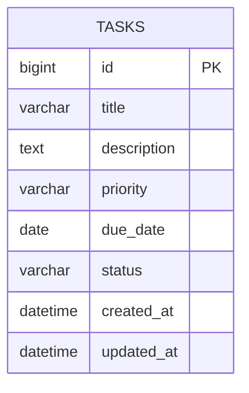

# データベース設計

## ER図
今回は `tasks` テーブル1つのシンプルな構成とする。

## テーブル項目説明
| カラム名 | 型 | 説明 |
|---|---|---|
| id | bigint (PK) | タスクの一意なID |
| title | varchar | タスクのタイトル(必須) |
| description | text | タスクの説明(任意) |
| priority | varchar | 優先度(低/中/高、任意) |
| due_date | date | 期限(任意) |
| status | varchar | 未着手 / 進行中 / 完了 のいずれか。ボードの列と対応する |
| created_at | datetime | 作成日時 |
| updated_at | datetime | 更新日時 |
