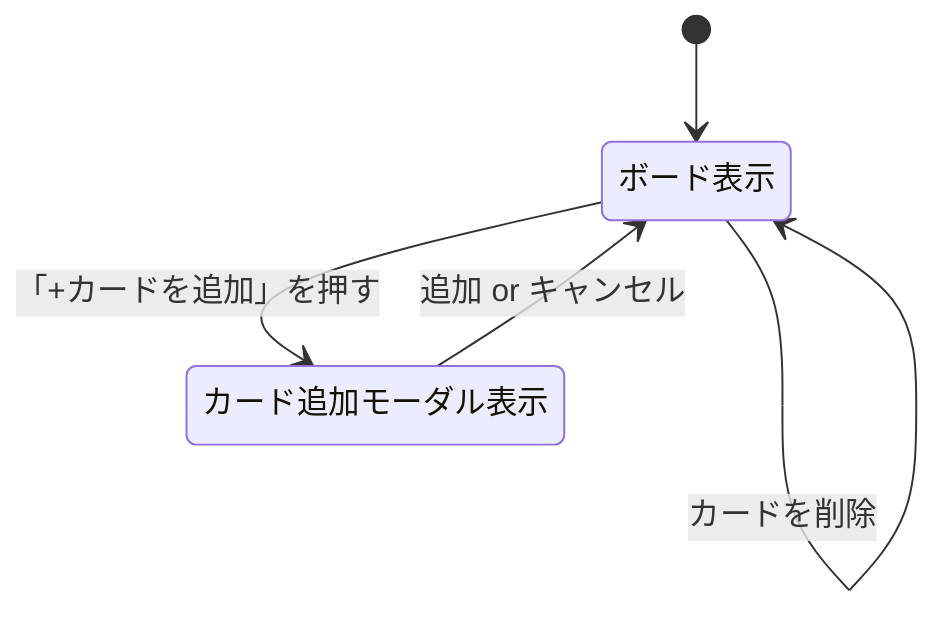

# 画面設計

## 画面構成
- 画面はボード画面1つのみで、画面間の遷移はない

## 画面遷移(画面内の状態遷移)

```mermaid
stateDiagram-v2
    [*] --> ボード表示
    ボード表示 --> カード追加モーダル表示: 「+カードを追加」を押す
    カード追加モーダル表示 --> ボード表示: 追加 or キャンセル
    ボード表示 --> ボード表示: ドラッグ&ドロップで列間移動
    ボード表示 --> ボード表示: カードを削除
```
