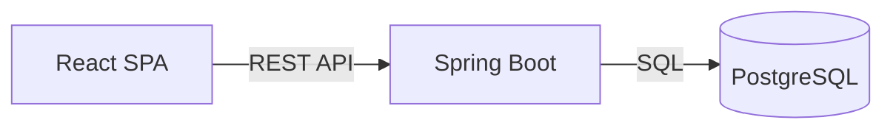

# 技術構成

- フロントエンド: React
- バックエンド: Java Spring Boot(REST API)
- データベース: PostgreSQL

## 全体構成

```mermaid
flowchart LR
    A[React SPA] -- REST API --> B[Spring Boot]
    B -- SQL --> C[(PostgreSQL)]
```
